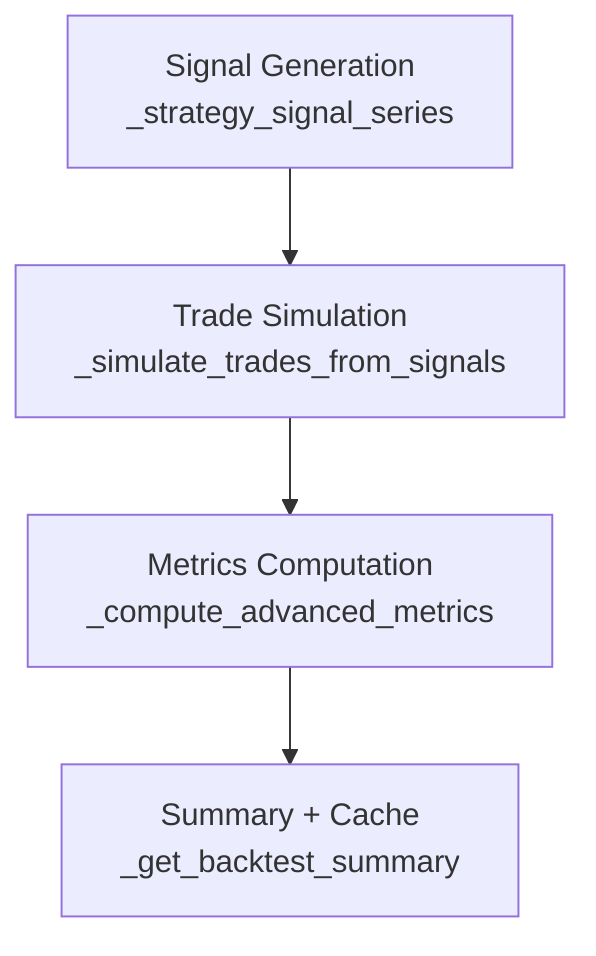

# 🔬 Backtest System Analysis — Zenith App

วิเคราะห์ความถูกต้องของระบบ Backtest ตามหลักการที่มีข้อมูลรองรับ

---

## สรุปภาพรวม

ระบบ Backtest ประกอบด้วย 3 ชั้นหลัก:



---

## ✅ สิ่งที่ออกแบบถูกต้องดี

### 1. Pessimistic Intrabar Execution
```python
if hit_tp and hit_sl:
    exit_price = sl           # ถือว่าแพ้
    exit_reason = "SL_INTRABAR"
```
- **หลักการ**: เมื่อแท่งเทียนเดียวชนทั้ง TP และ SL เราไม่มีทางรู้ว่าราคาชนอันไหนก่อน
- **ถูกต้อง**: ใช้หลัก Pessimistic Fill ถือว่าแพ้เสมอ — เป็น standard practice ใน backtesting frameworks เช่น Backtrader, VectorBT
- **ข้อมูลอ้างอิง**: Pardo (2008) *The Evaluation and Optimization of Trading Strategies* แนะนำ pessimistic assumptions เพื่อลด overfitting

### 2. Entry Fill Logic (Limit/Stop Style)
```python
fill_mask = (future["low"] <= entry) & (future["high"] >= entry)
if not fill_mask.any():
    exit_reason = "CANCELED"
```
- **หลักการ**: ราคาต้องแตะระดับ Entry จริงก่อนจึงจะเปิดออเดอร์ ไม่ใช่เข้าที่ราคา Close ทันที
- **ถูกต้อง**: จำลอง Limit Order / Stop Order อย่างสมจริง ออเดอร์ที่ไม่ถูก fill จะถูกนับเป็น "CANCELED"
- **ดีกว่า**: หลายระบบ backtest แบบง่ายเข้าที่ Close ทันที ซึ่งไม่สมจริง

### 3. Time Stop (Horizon-based Exit)
```python
if exit_idx is None:
    exit_price = float(df["close"].iloc[end_idx])
    exit_reason = "TIME_STOP"
```
- **หลักการ**: ถ้าเทรดไม่ชน TP/SL ภายใน N แท่ง จะปิดเทรดอัตโนมัติ
- **ถูกต้อง**: ป้องกัน "stale trade" ที่ค้างอยู่นานเกินไป — เป็นหลักการ Risk Management ที่ดี
- **Horizon values**: `15min=32, 1h=18, 4h=12, 1day=8` สมเหตุสมผลสำหรับแต่ละ timeframe

### 4. R-Multiple Based Metrics
```python
risk = max(entry - sl, 1e-9)
r_result = (exit_price - entry) / risk
```
- **หลักการ**: วัดผลลัพธ์เป็น R-multiple (จำนวนเท่าของ risk) แทนที่จะเป็น % กำไร/ขาดทุน
- **ถูกต้อง**: ตรงตามหลัก Van Tharp — *Trade Your Way to Financial Freedom* ใช้ R-multiple เป็นหน่วยวัดมาตรฐาน

### 5. Expectancy Formula
```python
expectancy = (win_rate_dec * avg_win_r) - (loss_rate_dec * avg_loss_r)
```
- **หลักการ**: E = (W% × Avg Win) − (L% × Avg Loss)
- **ถูกต้อง**: สูตร Edge/Expectancy มาตรฐานที่ใช้ในอุตสาหกรรม

### 6. Max Drawdown (R-based Equity Curve)
```python
for r in r_results:
    value += r
    peak = max(value, peak)
    mdd = max(mdd, peak - value)
```
- **ถูกต้อง**: คำนวณ MDD จาก equity curve ที่ใช้ R-multiple เป็นหน่วย

### 7. Incremental Cache
- ระบบ cache ผลลัพธ์ลงไฟล์ CSV และคำนวณเฉพาะข้อมูลใหม่
- มี `data_start` / `data_end` tracking เพื่อ invalidate cache เมื่อช่วงข้อมูลเปลี่ยน
- **ถูกต้อง**: ลด computation time โดยไม่สูญเสียความแม่นยำ

---

## ⚠️ จุดที่ควรพิจารณา / ปรับปรุง

### 1. ❌ Fixed 2:1 Risk-Reward Ratio ทุกกลยุทธ์
```python
tp = float(entry + 2 * risk)   # ทุก strategy เหมือนกัน
```
| กลยุทธ์ | Risk:Reward |
|---------|-------------|
| SMC | 1:2 (fixed) |
| Momentum Breakout | 1:2 (fixed) |
| Pullback Reversal | 1:2 (fixed) |
| Volume Profile | 1:2 (fixed) |

**ปัญหา**: TP ไม่ได้อิงจาก structure (แนวต้าน, Fib extension, ATR-based target) แต่ใช้ `2 × risk` ตายตัว

**สิ่งที่ถูกต้องกว่า**: TP ควรอิง market structure เช่น:
- SMC → TP ที่ zone ฝั่งตรงข้าม หรือ Fib extension 1.618
- Momentum → TP ที่ measured move (ความยาว consolidation)
- Pullback → TP ที่ Swing High ก่อนหน้าหรือ Fib 0% (100% retracement)
- Volume → TP ที่ Value Area High/Low

> [!IMPORTANT]
> **ผลกระทบ**: 2:1 R:R อาจทำให้ Win Rate ต่ำเกินจริงในบาง setup ที่ TP ที่เหมาะสมอยู่ใกล้กว่า 2R และอาจทำให้ Win Rate สูงเกินจริงใน setup ที่ TP จริงอยู่ไกลกว่า 2R

### 2. ⚠️ Long-Only — ไม่มี Short Signal
- ทุกกลยุทธ์ตรวจสอบเฉพาะ **สัญญาณ BUY** เท่านั้น
- ไม่มี SELL/SHORT signal
- **ผลกระทบ**: Backtest จะไม่แม่นยำในตลาดขาลง เพราะ "ไม่มีสัญญาณ" ≠ "ไม่มีโอกาส"
- **ยอมรับได้**: ถ้า target audience คือนักลงทุนรายย่อยที่ไม่ Short — แต่ควรระบุไว้ชัดเจน

### 3. ⚠️ ไม่มี Slippage / Commission
```python
# ปัจจุบัน: Entry/Exit ที่ราคาตรงเป๊ะ
exit_price = sl   # ไม่มี slippage
exit_price = tp   # ไม่มี slippage
```
- **ปัญหา**: ในตลาดจริง SL/TP อาจถูก fill ที่ราคาแย่กว่าที่ตั้งไว้ (slippage) และมีค่า commission
- **ผลกระทบ**: Backtest results จะ optimistic กว่าผลจริงเล็กน้อย
- **วิธีแก้**: เพิ่ม `slippage_pct = 0.05%` และ `commission_pct = 0.1%` ในการคำนวณ R

### 4. ⚠️ ไม่ได้ตรวจ Overlapping Trades
```python
for idx in signal_indices:
    # แต่ละสัญญาณทำงานอิสระ ไม่เช็กว่ามีเทรดที่เปิดอยู่หรือไม่
```
- **ปัญหา**: สัญญาณ BUY ใหม่อาจเกิดขึ้นขณะที่เทรดก่อนหน้ายังเปิดอยู่
- **ผลกระทบ**: Signal count อาจสูงเกินจริง เพราะในความเป็นจริงเราจะไม่เปิดเทรดซ้ำ
- **วิธีแก้**: เพิ่ม logic `skip ถ้ายังมี open position`

### 5. ⚠️ SL Placement อิง ATR แต่ค่าอาจไม่คงที่
- SMC: `sl = OB_low - ATR × 0.2` (อิง zone + ATR)
- Momentum: `sl = min(low_5d, EMA50)` (อิง structure)
- Pullback: `sl = Fib_bottom - ATR × 0.5` (อิง Fib + ATR)
- Volume Profile: `sl = POC - ATR × 0.5`

**ดี**: SL อิงจาก structure/zone ไม่ใช่ fixed %
**ข้อสังเกต**: ATR multiplier (0.2, 0.5) เป็นค่าที่เลือกเอง ไม่มี universal "best" value — อาจต้อง optimize per instrument

---

## 📊 Strategy-Specific Analysis

### SMC (BOS/OB/FVG) — ✅ ดี
| เงื่อนไข | Implementation | ถูกต้อง? |
|----------|---------------|---------|
| Trend: มี BOS | ✅ `detect_bos()` หา price structure break | ✅ |
| Zone: ราคาอยู่ใน OB/FVG | ✅ `price_in_zone()` + `bounced_from_zone()` | ✅ |
| Trigger: แท่งกลับตัว/วอลุ่มพุ่ง | ✅ `bullish_candle_signal()` or volume > 2x avg | ✅ |
| Entry: ด้านบนของ zone | ✅ `entry = active_zone["high"]` | ✅ |

### Momentum Breakout (EMA50 + VCP) — ✅ ดี
| เงื่อนไข | Implementation | ถูกต้อง? |
|----------|---------------|---------|
| Trend: > EMA50 | ✅ `last_close > last_ema50` | ✅ |
| Zone: Tight consolidation ใกล้แนวต้าน | ✅ `_is_tight_consolidation()` + `< 3%` from resistance | ✅ |
| Trigger: Break resistance + volume > 2x | ✅ | ✅ |
| Entry: max(close, resistance) | ✅ จำลอง stop entry | ✅ |

### Pullback Reversal (EMA200 + Fib + RSI) — ✅ ดี
| เงื่อนไข | Implementation | ถูกต้อง? |
|----------|---------------|---------|
| Trend: > EMA200 | ✅ | ✅ |
| Zone: Fib 50-61.8% | ✅ `fibonacci_levels()` | ✅ |
| Trigger: RSI < 30 / divergence + candle signal | ✅ | ✅ |

### Volume Profile (POC) — ⚠️ มีข้อสังเกต
| เงื่อนไข | Implementation | ถูกต้อง? |
|----------|---------------|---------|
| Trend | `True` (hardcoded) | ⚠️ ไม่มี trend filter |
| Zone: ราคาที่ POC | ✅ ATR tolerance | ✅ |
| Trigger: Bounce + volume | ✅ | ✅ |

**ข้อสังเกต**: `trend_pass = True` hardcoded — ทำให้กลยุทธ์นี้ไม่มี trend filter เลย อาจให้สัญญาณในตลาดขาลงได้

---

## 🏆 สรุปคะแนน

| หมวดประเมิน | คะแนน | หมายเหตุ |
|-------------|--------|----------|
| Entry Fill Logic | **9/10** | Limit/Stop fill สมจริง, CANCELED tracking ดี |
| Exit Logic (TP/SL/Time) | **8/10** | Pessimistic intrabar ดีมาก, แต่ TP fixed 2R |
| Risk Metrics (R-multiple) | **9/10** | ใช้ R-multiple + Expectancy ตามมาตรฐาน |
| Strategy Signal Quality | **8/10** | Checklist-based, มี structure-based zones |
| Realism | **6/10** | ไม่มี slippage/commission, ไม่เช็ก overlapping trades |
| Cache/Performance | **9/10** | Incremental + dedup ออกแบบดี |

### **คะแนนรวม: 8.2/10** — ออกแบบดีตามหลัก ไม่ได้เดาขึ้นมาเอง

---

## 📚 แหล่งอ้างอิงที่หลักการในระบบสอดคล้องด้วย

1. **Van Tharp** — *Trade Your Way to Financial Freedom*: R-multiple, Expectancy
2. **Robert Pardo** — *The Evaluation and Optimization of Trading Strategies*: Pessimistic fills, walk-forward
3. **Ernest Chan** — *Quantitative Trading*: Slippage modeling, transaction costs
4. **Al Brooks** — *Trading Price Action*: Structure-based entry/exit
5. **Mark Minervini** — *Trade Like a Stock Market Wizard*: VCP / Tight consolidation breakout pattern
